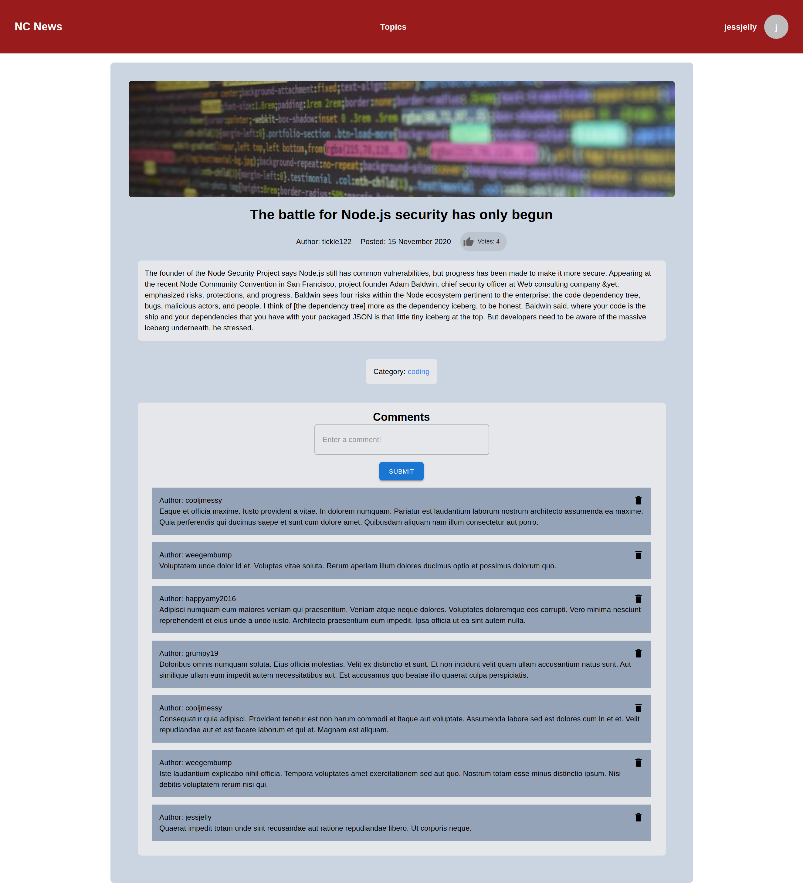
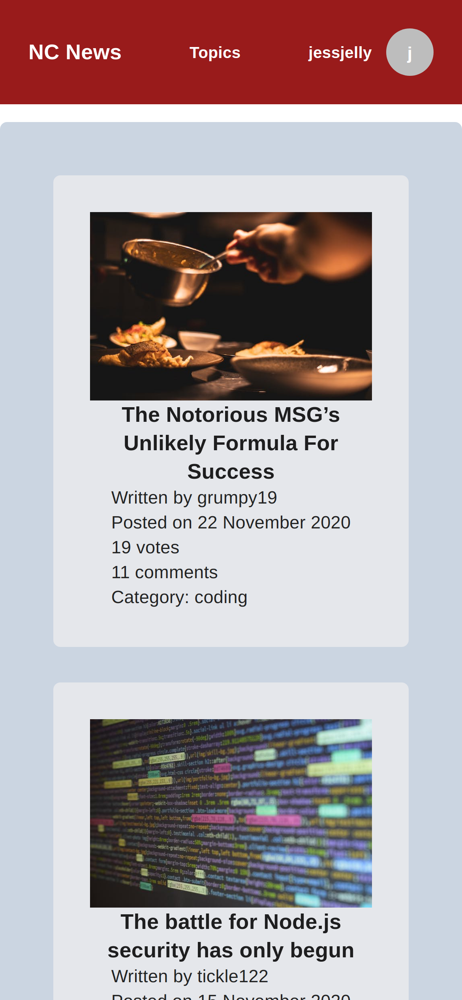
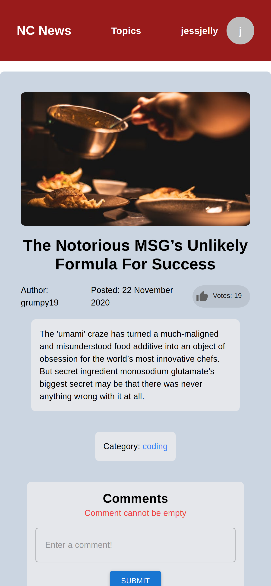

## NC News: A Social News Platform

Northcoders News is a dynamic web application built with React, serving as a platform for news aggregation, content rating, and discussion. The application interacts with a backend API, developed in a previous project, to provide a rich user interface. Users can browse articles, cast votes, filter by topic, as well as contribute to the discussion by posting and deleting comments.


### Desktop Screenshot

 

### Mobile Screenshot (iPhone 14 Plus)
 
 

### Links

- Solution URL: [Add solution URL here](https://github.com/dannygorgon/qr-code-card)
- Live Site URL: [Add live site URL here](https://dannygorgon.github.io/qr-code-card/)

## My process
- Worked with mobile layout first
- Develop the Desktop Version
- Researched features
- Cross-Browser Testing
- Tested responsiveness
- Compiled Readme 
### Built with
- React
- Tailwind CSS
- Material UI
- Flexbox
- Mobile-first workflow


### What I learned

Learned fluid responsive. "font-size: calc(15px + 0.390625vw);" 

This formula calculates our font size as 15px plus 0.00390625% of the screen width. These values have been specifically chosen because they result in the perfect font sizes at every breakpoint:


```css
p {
        font-size: calc(15px + 0.390625vw);
    }
```

Learned nested border radius - Thanks to 30 Seconds Code for the guide!! [@username](https://github.com/30-seconds)

 


```css
.outer {
  border-radius: 24px;
  padding: 8px;
}

.inner {
  border-radius: 16px;
}
```

### Continued development

- Wish to implement sorting
- Improve overall styling
- Add functional login


### Useful resources


## Acknowledgments

Dedicated to Jan, the Northcoders team, all my pair partners and my family.


